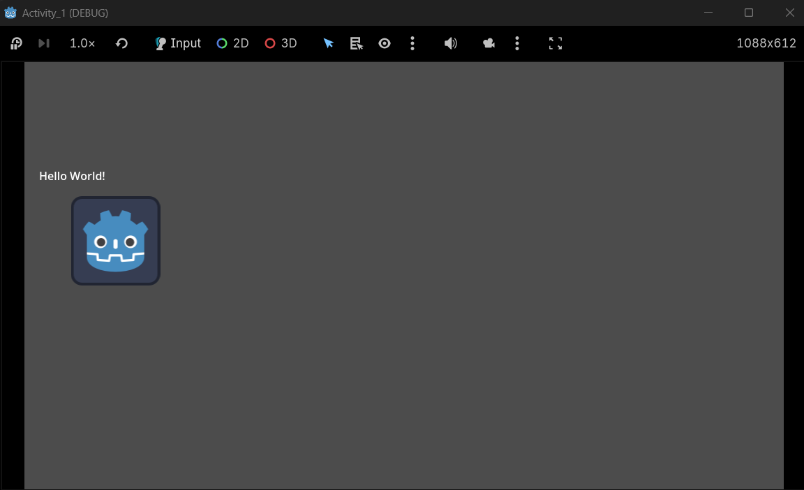

# Game Development Activities
**Repository for Game Development Course**

---

## 👤 Student Details
- **Name:** Alexa Rose I. Miñoza
- **Course/Year:** BSIT - 3
- **Schedule:** FS 4:30PM - 7:00PM
- **Instructor:** Mr. Baricuatro

---

## 📂 Activity Index
1. [Week 1](#activity-1-simple-scene-with-a-moving-node)

---

## 🎮 Week 1: Simple Scene with a Moving Node
**Date:** February 2026

### Description
This project demonstrates a basic Godot 2D scene featuring a "Hello World" label and a Sprite2D node that moves programmatically using GDScript. 

### Features
- **Hello World:** A standard text label displayed on the scene.
- **Automated Movement:** A Sprite2D node (Godot Icon) moves across the screen at a fixed speed and resets position when it goes off-screen.
- **Scripting:** Uses `_process(delta)` to update coordinates every frame.

### Screenshots

## 🎮 Week 2: Activity 1
**Date:** February 2026

### Description
This project handles input (keyboard/gamepad), physics bodies (rigid/kinematic), collision detection. Basics of player controllers (movement, jumping).

### Features
- **Frog Player:** Added a frog player from an asset i got online.
- **Scripting:** Added a script for the player's movements such as running, walking, jumping, and idle.

### Screenshots

---
