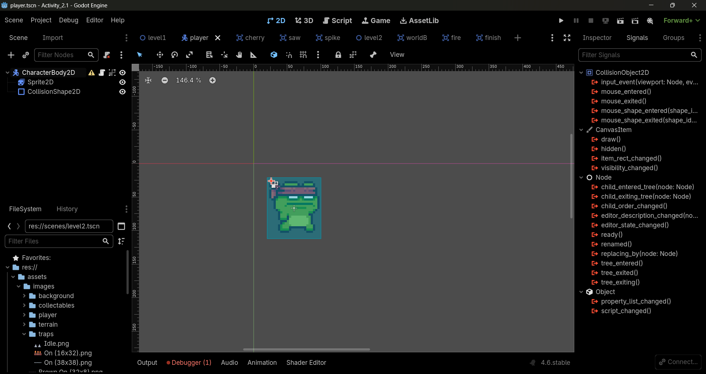
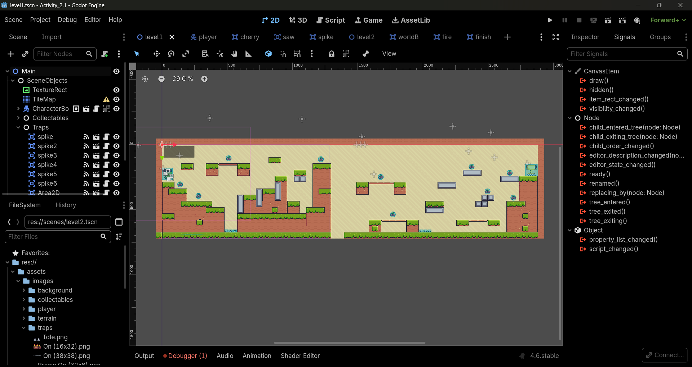
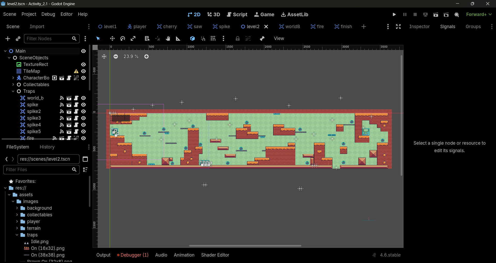

# Game Development Activities
**Repository for Game Development Course**

---

## 👤 Student Details
- **Name:** Alexa Rose I. Miñoza
- **Course/Year:** BSIT - 3
- **Schedule:** FS 4:30PM - 7:00PM
- **Instructor:** Mr. Baricuatro

---

## 📂 Activity Index
1. [Week 1](#activity-1-simple-scene-with-a-moving-node)

---

## 🎮 Week 1: Simple Scene with a Moving Node
**Date:** February 2026

### Description
This project demonstrates a basic Godot 2D scene featuring a "Hello World" label and a Sprite2D node that moves programmatically using GDScript. 

### Features
- **Hello World:** A standard text label displayed on the scene.
- **Automated Movement:** A Sprite2D node (Godot Icon) moves across the screen at a fixed speed and resets position when it goes off-screen.
- **Scripting:** Uses `_process(delta)` to update coordinates every frame.

### Screenshots

## 🎮 Week 2: Activity 1
**Date:** February 2026

### Description
This project handles input (keyboard/gamepad), physics bodies (rigid/kinematic), collision detection. Basics of player controllers (movement, jumping).

### Features
- Added a frog player from an asset i got online.
- Added a script for the player's movements such as running, walking, jumping, and idle.

### Screenshots

## 🎮 Week 2: Activity 2 Level Design
**Date:** February 2026

### Description
This project uses tilemaps for grid-based levels, adding hazards (spikes/traps), designing flow (pacing, difficulty curves). Level 1 is noticeable easier than level 2. Implemented traps. No HP, once caught in trap restart from the beginning of the level. There is a notification when entering level 2.

### Features
- Added a background for the game
- Added tiles through Tilemap
- Incorporated traps and collectibles

### Screenshots

## 🎮 Week 3: Activity 1 UI/UX & Audio
**Date:** February 2026

### Description
This project integrates user interface elements and a complete audio system into the 2D game prototype, providing clear player feedback through a HUD, menus, and sound.

### Features
- Heads-Up Display (HUD): A CanvasLayer interface featuring a player health bar (ProgressBar) and a real-time score tracker.
- Menu Systems: Functional Main Menu and Game Over screens using UI containers (VBoxContainer) for easy button layouts.
- Audio Buses: Custom audio routing to separate and mix Sound Effects (SFX) and Music volumes.
- Sound Effects: Positional audio (AudioStreamPlayer2D) that plays when jumping, taking damage, or collecting items.
- Background Music: Continuous game music that plays automatically using an AudioStreamPlayer node.

### Video
https://github.com/user-attachments/assets/65700e66-9382-4f9b-8f5b-b27cff0c018f

## 🎮 Week 3: Activity 2 AI & Enemies
**Date:** February 2026

### Description
This project introduces intelligent enemies using a Finite State Machine (FSM) to switch between patrol, aggro, and chase behaviors based on the player's position.

### Features
- AI State Machine: A logic system that seamlessly switches the enemy between Patrol, Aggro, and Chase modes.
- Edge Detection: RayCast2D sensors that stop the enemy from walking off ledges or into walls.
- Player Detection: An Area2D zone that spots the player and triggers a brief warning animation.
- Pathfinding: Math logic that makes the enemy actively track and run toward the player.
- Combat Logic: A hitbox that deals damage and knocks the player backward upon contact.

### Video
https://github.com/AlexaAko548/Game_Dev/blob/main/proofs/week3-act2.mp4

---
